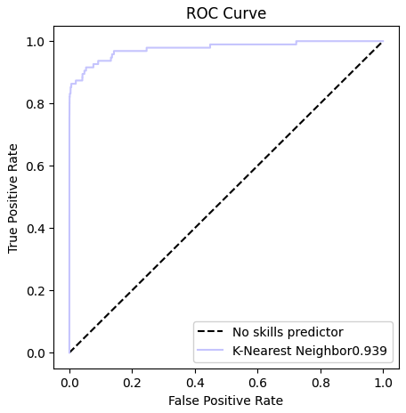

# Credit Card Fraud Detection

The model analyzed in this card is able to identify fraudulent credit card transactions. Given transactional data the model returns the label of 1 if it calssifies the transaction as fraud, otherwise it will return the label 0.  

On this page a general description of the models architecture, performance, limitations and trade-offs is given.

## Intented Use
Classify credit card transaction as fraudulent or not.

## Model Description
 Inputs:  
    · Transactional data (features V1 to V28): Numerical features that are the output of a principal component analysis. Due to confidentiallity reasons we don't have more information on the background of the original data.  
    · Amount: Numerical feature that represents the amount of the transaction.  
    · Time: Numerical feature that represents the amount of seconds elapsed between a transaction and the first transaction in the dataset.  

Outputs: For each input transaction a classification label is provided. The available labels are 1 for fraud and 0 for normal transaction.

## Model Architecture
A Random Forest model with the following hyperparameters:
    · maximum tree depth 14
    · minimum number of samples requires to split and internal node 10
    · gini function as criterion for measuring the quality of the split
    · maximum number of features when looking for a split equal to 5
    · 220 estimators

## Performance Metrics
Four performance metrics where used for assessing the model:
* The overal ability in correctly identifying the positive class (fraud) was assessed through the **recall** metric.
* The ability to classify as positive only positive classes and not missclassifying as positive negative instances, was assessed through the **precision** metric.
* The overal performance was measured using the F1-score and the Area Under the PR Curve, that are standard metrics for imbalanced classification, and can capture the balance between precison and recall.

The model was trained and tested on a dataset created by the Machine Learning Group of Universite Libre de Bruxelles and Wordline. More information can be found at the Datasheet.
Note, because the dataset was highly imbalanced (only ~0.2% of the model belonged to the positive class), we performed SMOTE (Synthetic Minority Oversampling) oversampling during training.

## Ethical Consideration
The data fed to the algorithm were the product of a PCA analysis, so we cannot provide more information on potential model bias due to a biased dataset.

## Limitations and Recommendations
The models was created using the transformed/anonymised data provided above. As we don't have information on how these data were originally generated,the models application is limited to this dataset. For further exmploration we could use synthetica data that have been produced using the original dataset. An already created synthetic dataset for this application can be found in Kaggel (https://www.kaggle.com/competitions/playground-series-s3e4).

## Performance Analysis
The dataset mentioned above was split into a train and test set. 20% of the data were kept for the test set and stratification was used to preserve the propotion of fraud and not fraud transaction same in both datasets. The random_sample parameter was set to 42. For this test set the model has the following performance:

| Model        | Precision   | Recall      | f1-score     | ROC AUC      |
| -----------  | ----------- | ----------- | -----------  | -----------  | 
| Random Forest|  0.760417   |  0.768421   |  0.764398    | 0.976591     |

The models Area under the ROC Curve graph is presented below:  

